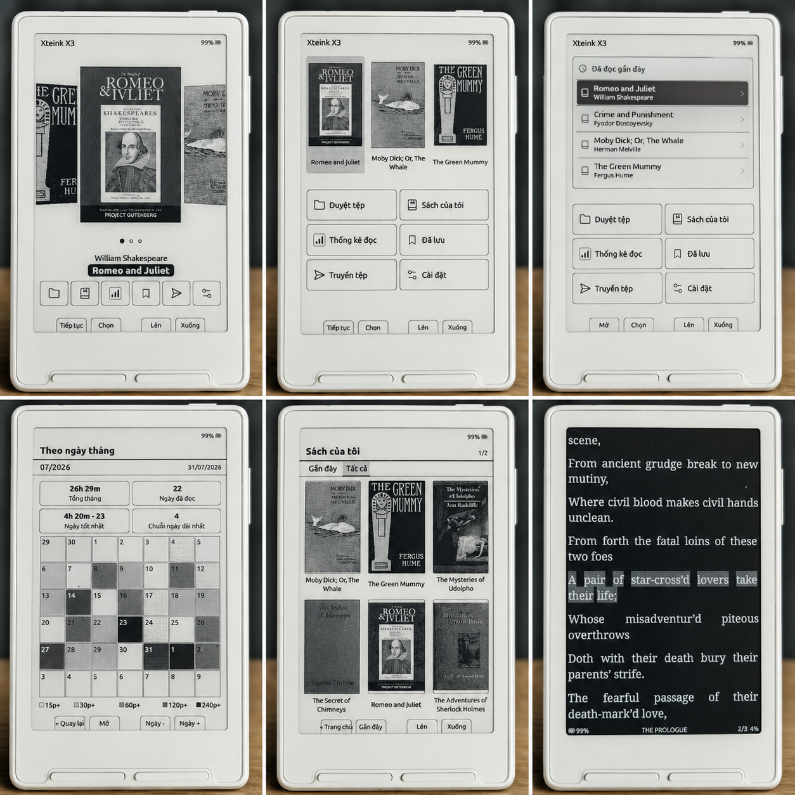

# CrossVi

[](https://github.com/tvhdc/crossvi/releases/latest)
[](https://github.com/tvhdc/crossvi/actions/workflows/ci.yml)
[](#hardware-compatibility)
[](LICENSE)

<p align="center">
  <strong>Open-source e-reader firmware for Xteink X3 and X4.</strong><br>
  Based on CrossPoint and designed for a focused, button-driven reading experience.
</p>



CrossVi extends
[CrossPoint Reader](https://github.com/crosspoint-reader/crosspoint-reader)
with a richer library, reading statistics, configurable Home layouts, and
additional safeguards for data stored on the SD card.

> [!WARNING]
> CrossVi has not yet been validated on every newer X3/X4 hardware revision.
> Read [Hardware compatibility](#hardware-compatibility) before flashing.

**[Download v1.1.1](https://github.com/tvhdc/crossvi/releases/download/v1.1.1/firmware.bin) ·
[Installation](#installation) · [User Guide](USER_GUIDE.md) ·
[Report a Bug](https://github.com/tvhdc/crossvi/issues/new?template=bug_report.yml) ·
[Contributing](docs/contributing/README.md)**

## Highlights

- **Reading:** EPUB, TXT, Markdown, XTC, XTCH, and BMP.
- **Library:** Four Home layouts, list and cover views, search, sorting, paging,
  pinning, incremental updates, EPUB image optimization, and reusable cover caches.
- **Reader tools:** Bookmarks, highlights, dictionary lookup, in-book search,
  clipping export, screenshots, and device, book, and calendar statistics.
- **Customization:** Built-in Noto Serif and downloadable fonts up to 28 pt, per-book
  typography, margins, spacing, orientation, image handling, and reader dark mode.
- **Learning and migration:** A Vietnamese-interface quiz using 3,000 common
  English words, plus one-time reading-statistics import from CPR-vCodex.
- **Connectivity:** Wi-Fi file transfer, OPDS, Calibre/WebDAV, KOReader Sync, OTA, and Nearby Sync.
- **Device and reliability:** Configurable buttons, sleep screens, Quick Resume,
  clock, automatic and tilt page turns, plus transactional storage for important data.

## Installation

Download [`firmware.bin`](https://github.com/tvhdc/crossvi/releases/latest/download/firmware.bin)
from the latest [CrossVi release](https://github.com/tvhdc/crossvi/releases), then select
**Custom .bin** in the [CrossPoint web flasher](https://crosspointreader.com/#flash-tools).
Back up the SD card before flashing.

## Hardware compatibility

CrossVi targets the Xteink X3 and X4, but production revisions may use different
display or power hardware.

- **New X3 units:** If you have just received the device and have never flashed
  custom firmware, stay on stock firmware for now. New production runs may use
  the UC8279 display controller. CrossVi can detect it, but support still needs
  validation on the new hardware. See the upstream
  [controller work](https://github.com/crosspoint-reader/crosspoint-reader/pull/2707).
- **New X4 units:** Some revisions require a
  [battery-latch fix](https://github.com/crosspoint-reader/crosspoint-reader/pull/2774)
  to remain powered without USB. CrossVi 1.1.1 includes that behavior, but it
  has not yet been validated on a new-revision X4.

Keep the SD card backed up and flash only a recoverable device.

## Build from source

Requirements: [pioarduino](https://github.com/pioarduino/pioarduino), Python
3.8+, Git, and the repository submodules.

```bash
git clone --recursive https://github.com/tvhdc/crossvi.git
cd crossvi
pio run -e default
```

The firmware is written to `.pio/build/default/firmware.bin`.

The desktop simulator can check build, boot, UI, and basic application flows:

```bash
python3 scripts/run_simulator.py x3
python3 scripts/run_simulator.py x4
```

Hardware-dependent behaviour such as e-paper refresh, ghosting, SD timing,
power use, buttons, and sleep/wake must be tested on a physical device.

## Documentation

- [User Guide](USER_GUIDE.md)
- [Contributing](docs/contributing/README.md)
- [Supported file formats](docs/file-formats.md)
- [Wi-Fi file transfer](docs/webserver.md)
- [Troubleshooting](docs/troubleshooting.md)

## Development transparency

CrossVi is developed with AI assistance. AI tools help with code exploration,
drafting changes, and reviewing tests. The maintainer makes the design decisions,
reviews and validates every release, and remains responsible for the firmware.

## Credits

CrossVi is a fork of
[CrossPoint Reader](https://github.com/crosspoint-reader/crosspoint-reader),
which remains its technical foundation. It also adapts selected ideas from
[CrossInk](https://github.com/uxjulia/CrossInk),
[CPR-vCodex](https://github.com/franssjz/cpr-vcodex), and other community
contributions where they fit the X3/X4 hardware.

CrossVi is licensed under the [MIT License](LICENSE), preserves upstream
attribution, and is not affiliated with Xteink.
