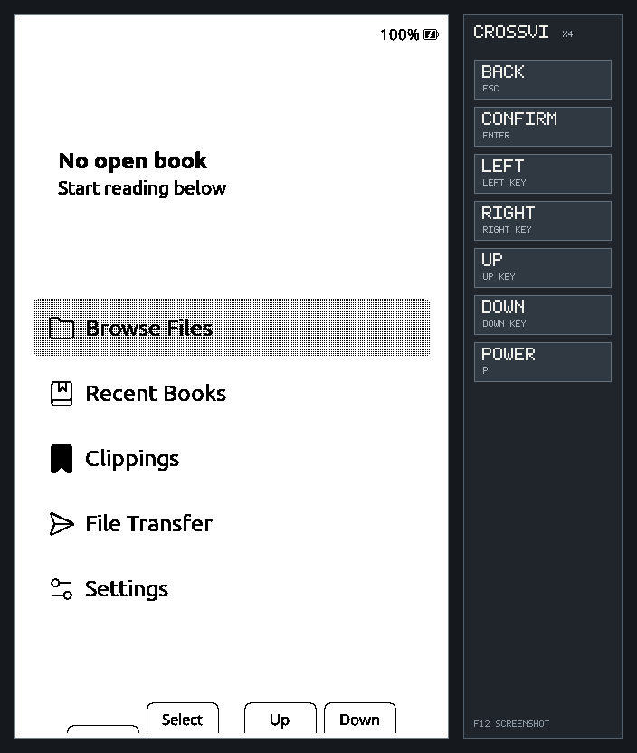

# CrossVi

[English](README.md) | [**Tiếng Việt**](README.vi.md)

CrossVi là firmware máy đọc sách mã nguồn mở, đa ngôn ngữ dành cho Xteink X3 và
X4 sử dụng ESP32-C3. Dự án được phát triển độc lập từ
[CrossPoint Reader](https://github.com/crosspoint-reader/crosspoint-reader), tập
trung vào trải nghiệm đọc ổn định, chữ tiếng Việt, dữ liệu thẻ nhớ an toàn và
những tính năng phù hợp với tài nguyên giới hạn của thiết bị.

> **Tình trạng dự án:** CrossVi hiện là bản thử nghiệm dành cho phát triển. Dự
> án đã có kiểm thử trên máy tính, biên dịch firmware, phân tích tĩnh
> và kiểm thử mô phỏng X3/X4, nhưng vẫn cần xác minh trên cả X3 và X4 thật
> trước khi phát hành bản ổn định.



## Điểm nổi bật

- Đọc EPUB 2/3, TXT/Markdown dạng văn bản, XTC/XTCH và ảnh BMP.
- Có thiết lập hiển thị riêng từng sách, các chế độ dựng EPUB, EPUB Safe Mode,
  dấu trang, đoạn trích, từ điển StarDict, thống kê đọc, chế độ tập trung và tự
  lật trang.
- Tích hợp Noto Serif và Noto Sans hỗ trợ tiếng Việt; có thể cài thêm họ
  phông `.cpfont` đã được kiểm tra từ thẻ nhớ.
- Có trình duyệt tệp, sách gần đây, chuyển tệp bằng Web UI, WebDAV, Calibre
  Wireless, OPDS, đồng bộ tiến độ KOReader và cập nhật OTA.
- Nhiều giao diện dành cho màn hình 4 inch, tùy chỉnh nút bấm, màn hình ngủ,
  chụp màn hình và nghiêng máy để lật trang trên X3.
- 30 ngôn ngữ giao diện; các tính năng riêng của CrossVi có đầy đủ tiếng Việt.
- Nearby Sync thử nghiệm cho phép hai máy CrossVi ở gần nhau trao đổi vị trí đã
  xác nhận hoặc bản thống kê. Dữ liệu Nearby không được mã hóa.

CrossVi tập trung vào việc đọc sách; dự án không hướng tới trình duyệt web,
phát nội dung đa phương tiện, trò chơi hoặc các tác vụ nền nặng.

## Thiết bị và định dạng được hỗ trợ

| Thiết bị | Trạng thái | Ghi chú |
| --- | --- | --- |
| Xteink X3 | Mục tiêu được hỗ trợ | ESP32-C3; có lật trang bằng nghiêng máy |
| Xteink X4 | Mục tiêu được hỗ trợ | ESP32-C3 |

| Định dạng | Mức hỗ trợ |
| --- | --- |
| `.epub` | EPUB 2/3 có dàn lại nội dung |
| `.txt`, `.md` | Trình đọc văn bản; Markdown hiện được xử lý như văn bản thường |
| `.xtc`, `.xtch` | Tập con bố cục cố định v1.0 không nén đã được kiểm thử, dùng trang 480×800 |
| `.bmp` | Xem ảnh và dùng ảnh làm màn hình ngủ |

Trang XTC/XTCH hiển thị 1:1 trên X4 và được thu vừa, căn giữa trên X3. Định dạng
này không có tùy biến phông/cỡ chữ như EPUB, chọn từ để tra, lưu đoạn trích
hoặc đồng bộ vị trí KOReader. Xem [quy ước XTC/XTCH](lib/Xtc/README).

## Phông chữ và cỡ chữ

Noto Serif và Noto Sans tích hợp có đủ kiểu Thường, Đậm, Nghiêng và Đậm Nghiêng
ở các cỡ 12, 14, 16 và 18 pt.

Họ phông `.cpfont` tương thích trên thẻ nhớ có thể cung cấp thêm 20, 22, 24,
26 và 28 pt. Màn chọn cỡ chỉ hiển thị những cỡ họ phông đang chọn thực sự có,
và máy chỉ nạp một tệp `.cpfont` vật lý tại một thời điểm. Firmware không nhúng sẵn
các tệp phông lớn, vì vậy bản cài mới vẫn chỉ hiện cỡ tích hợp cho đến khi cài
một họ phông trên thẻ nhớ có các cỡ lớn hơn.

Để tạo hoặc cài phông chữ:

1. Mở [công cụ tạo phông chữ CrossPoint](https://crosspointreader.com/fonts), hoặc
   chạy `lib/EpdFont/scripts/fontconvert_sdcard.py` trên máy tính.
2. Chuyển TTF/OTF thành `.cpfont`; thiết bị không đọc trực tiếp TTF/OTF.
3. Chép họ phông đã tạo vào `/fonts/TenFamily/` hoặc `/.fonts/TenFamily/` trên thẻ
   nhớ.
4. Chọn tại **Cài đặt → Trình đọc → Phông chữ khi đọc**.

Khi tạo phông tiếng Việt, nên dùng cấu hình `vietnamese-reading`. Cấu hình này
kiểm tra chữ NFC, dấu tổ hợp NFD cần thiết, dấu câu và từng kiểu chữ được xuất
ra. Giấy phép của phông nguồn tiếp tục áp dụng cho mọi tệp `.cpfont` được tạo ra.

## Cài đặt

### Cảnh báo an toàn

Một số máy mua từ bên thứ ba bị khóa chức năng nạp firmware qua USB. Xteink
Unlocker công khai hiện hỗ trợ CrossPoint và CrossInk làm firmware mở khóa,
không hỗ trợ CrossVi. **Không dùng CrossVi làm firmware mở khóa cho máy đang bị
khóa USB**; làm vậy có thể khiến thiết bị không còn đường khôi phục được hỗ trợ.

CrossVi hiện chưa phát hành bản ổn định đã được kiểm chứng trên phần cứng. Nếu
bạn chủ động thử bản phát triển, hãy sao lưu thẻ nhớ trước và chỉ dùng
`firmware.bin` từ nguồn biên dịch tin cậy hoặc tự biên dịch từ mã nguồn.

### Nạp bằng trình duyệt

1. Bật máy và kết nối bằng cáp USB-C có truyền dữ liệu.
2. Mở [công cụ nạp CrossPoint](https://crosspointreader.com/#flash-tools).
3. Chọn X3 hoặc X4, chọn **Custom .bin** rồi mở `firmware.bin` của CrossVi.
4. Giữ máy kết nối cho đến khi quá trình nạp hoàn tất.

### Nạp bằng dòng lệnh

Với Python 3.10 trở lên, hãy cài bản
[`esptool`](https://github.com/espressif/esptool) mới nhất, sau đó ghi firmware ứng
dụng tại địa chỉ `0x10000`:

```bash
python3 -m pip install --upgrade esptool
esptool --chip esp32c3 --port /dev/ttyACM0 --baud 921600 \
  write-flash 0x10000 /duong-dan/toi/firmware.bin
```

Thay `/dev/ttyACM0` bằng cổng thiết bị trên máy tính của bạn. Có thể khôi phục
firmware CrossPoint chính thức bằng cùng công cụ web.

## Dữ liệu trên thẻ nhớ

CrossVi giữ dữ liệu làm việc tương thích với CrossPoint trong `/.crosspoint` ở
những nơi được hỗ trợ. Thư mục này chứa cả bộ nhớ đệm có thể tạo lại và dữ
liệu quan trọng như cài đặt, vị trí đọc, dấu trang, đoạn trích và thống kê.

Không xóa toàn bộ thư mục này như một bước sửa lỗi thông thường. Hãy dùng chức
năng xóa bộ nhớ đệm trong firmware trước, đồng thời luôn sao lưu thẻ nhớ trước khi
đổi firmware hoặc sửa dữ liệu thủ công. Xem
[định dạng dữ liệu](docs/file-formats.md) để biết cấu trúc trên thẻ nhớ.

## Phát triển

### Yêu cầu

- [pioarduino](https://github.com/pioarduino/pioarduino), hoặc VS Code cùng
  tiện ích tương ứng
- Python 3.8 trở lên
- `clang-format` 21 nếu đóng góp mã nguồn
- Cáp USB-C có truyền dữ liệu khi làm việc với máy thật

### Biên dịch

```bash
git clone --recursive https://github.com/tvhdc/crossvi.git
cd crossvi
pio run
```

Nếu đã clone mà chưa lấy submodule:

```bash
git submodule update --init --recursive
```

Các bước kiểm tra chính trước khi đóng góp:

```bash
./bin/clang-format-fix
pio check --fail-on-defect low --fail-on-defect medium --fail-on-defect high
pio run
```

### Trình mô phỏng X3/X4

Trình mô phỏng chạy giao diện và bộ dựng thật của CrossVi mà không cần máy đọc
sách:

```bash
python3 scripts/run_simulator.py x3
python3 scripts/run_simulator.py x4
```

Trình mô phỏng không chứng minh được bóng mờ e-paper, tốc độ thẻ nhớ, sóng radio,
pin hoặc mức dùng bộ nhớ cao nhất trên phần cứng thật. Xem
[hướng dẫn trình mô phỏng](docs/contributing/simulator.md) và
[checklist phần cứng](docs/contributing/hardware-validation.md).

## Tài liệu

- [Hướng dẫn sử dụng](USER_GUIDE.md)
- [Hướng dẫn đóng góp](docs/contributing/README.md)
- [Kiến trúc](docs/contributing/architecture.md)
- [Kiểm thử và gỡ lỗi](docs/contributing/testing-debugging.md)
- [Web Server](docs/webserver.md)

## Đóng góp và hỗ trợ

CrossVi chào đón những đóng góp tập trung vào trải nghiệm đọc. Trước khi làm một
thay đổi lớn, hãy mở [thảo luận Ý tưởng](https://github.com/tvhdc/crossvi/discussions/categories/ideas)
để tránh trùng công việc.

- Báo lỗi có thể tái hiện tại [GitHub Issues](https://github.com/tvhdc/crossvi/issues).
- Đặt câu hỏi và đề xuất tính năng tại
  [GitHub Discussions](https://github.com/tvhdc/crossvi/discussions).
- Đọc [GOVERNANCE.md](GOVERNANCE.md) trước khi đóng góp.

## Nguồn gốc, ghi nhận và giấy phép

CrossVi là fork độc lập của
[CrossPoint Reader](https://github.com/crosspoint-reader/crosspoint-reader).
CrossPoint và các tác giả đóng góp là nền tảng kỹ thuật của dự án này. Một số ý
tưởng trải nghiệm đọc được tham khảo từ
[CrossInk](https://github.com/uxjulia/CrossInk) và được triển khai lại theo giới
hạn tài nguyên và tương thích của CrossVi.

Dự án được phân phối theo [giấy phép MIT](LICENSE), đồng thời giữ nguyên thông
tin bản quyền và ghi nhận của upstream. Các tệp phông giữ giấy phép riêng của
chúng. CrossVi không trực thuộc Xteink hoặc bất kỳ nhà sản xuất thiết bị nào.
